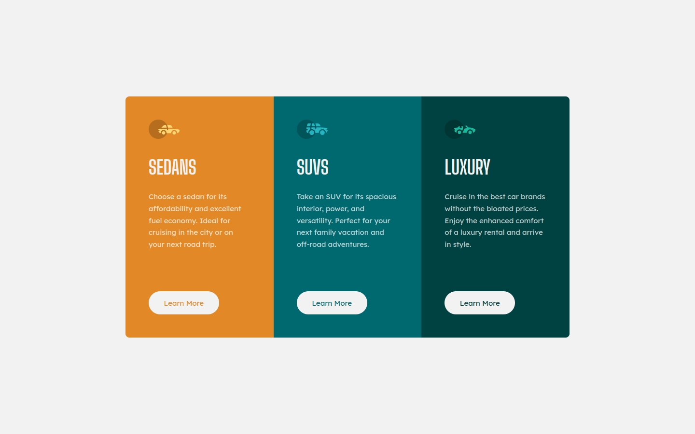

# Frontend Mentor - 3-column preview card component solution

This is a solution to the [3-column preview card component challenge on Frontend Mentor](https://www.frontendmentor.io/challenges/3column-preview-card-component-pH92eAR2-). Frontend Mentor challenges help you improve your coding skills by building realistic projects.

## Table of contents

- [Overview](#overview)
  - [The challenge](#the-challenge)
  - [Screenshot](#screenshot)
  - [Links](#links)
- [My process](#my-process)
  - [Built with](#built-with)
  - [What I learned](#what-i-learned)
  - [Useful resources](#useful-resources)
- [Author](#author)

## Overview

### The challenge

Users should be able to:

- [x] View the optimal layout depending on their device's screen size
- [x] See hover states for interactive elements

### Screenshot

### Links

- Solution URL: https://www.frontendmentor.io/solutions/3column-preview-card-component-built-with-html-and-css-GXiORFwOBZ
- Live Site URL: https://joshjavier.github.io/3-column-preview-card-component-v2/

## My process

### Built with

- Semantic HTML5 markup
- CSS custom properties
- Flexbox
- CSS Grid
- Mobile-first workflow

### What I learned

Another take on another simple challenge using basic HTML and CSS.

Again, I added CSS variables that allow customization, such as `--max-width`, `--min-height`.

For the card's layout logic, I used the [Flexbox Holy Albatross technique](https://heydonworks.com/article/the-flexbox-holy-albatross-reincarnated/) and added constraints specific to this layout. Ideally, the card can hold one to three child segments. That said, nothing prevents users from adding more child segments, but the layout will switch to a vertical layout to prevent columns that are too narrow for the contained elements.

### Useful resources

- [The Flexbox Holy Albatross Reincarnated](https://heydonworks.com/article/the-flexbox-holy-albatross-reincarnated/)

## Author

- Website - [Josh Javier](https://joshjavier.com/)
- Frontend Mentor - [@joshjavier](https://www.frontendmentor.io/profile/joshjavier)
